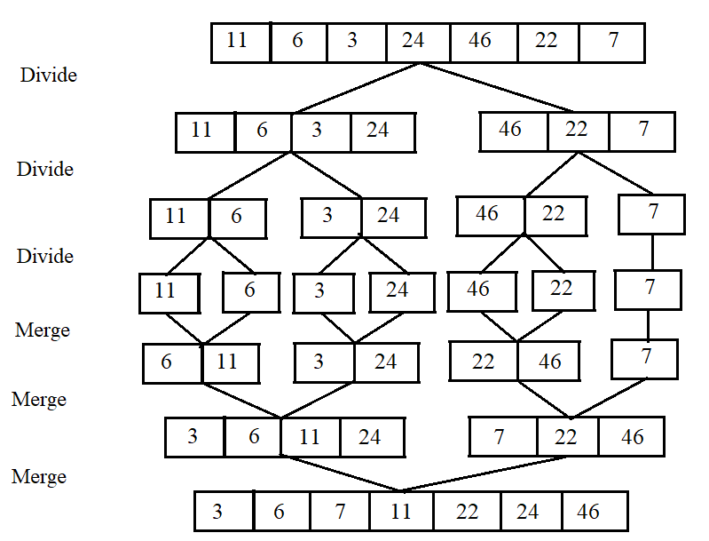

# 04. 정렬

이 장에서 다룰 정렬 알고리즘의 정의는 다음과 같다.

| 정렬 알고리즘 | 정의 |
| :-- | :-- |
| 버블(bubble) | 데이터의 인접 요소끼리 비교하고 swap 연산을 수행하며 정렬하는 방식 |
| 선택(selection) | 대상에서 가장 크거나 작은 데이터를 찾아가 선택을 반복하면서 정렬하는 방식 |
| 삽입(insertion) | 대상을 선택해 정렬된 영역에서 선택 데이터의 적절한 위치를 찾아 삽입하면서 정렬하는 방식 |
| 퀵(quick) | pivot 값을 선정해 해당 값을 기준으로 정렬하는 방식 |
| 병합(merge) | 이미 정렬된 부분 집합들을 효율적으로 병합해 전체를 정렬하는 방식 |
| 기수(radix) | 데이터의 자릿수를 바탕으로 비교해 데이터를 정렬하는 방식 |

## 04-1. 버블 정렬

버블 정렬(bubble sort)은 두 인접한 데이터의 크기를 비교해 정렬하는 방법이다. 정렬 과정은 다음과 같다.

1. 비교 연산이 필요한 루프 범위를 설정한다.
2. 인접한 데이터 값을 비교한다.
3. swap 조건에 부합하면 swap 연산을 수행한다.
4. 루프 범위가 끝날 때까지 2~3을 반복한다.
5. 정렬된 영역을 설정한다. 다음 루프를 실행할 때는 이 영역을 제외한다.
6. 비교 대상이 없을 때까지 1~5를 반복한다.

## 04-2. 선택 정렬

선택 정렬(selection sort)은 대상 데이터에서 최대나 최소를 나열된 순으로 찾아가며 선택하는 방법이다.

### 선택 정렬의 핵심 이론

최솟값 또는 최댓값을 찾고 남은 정렬 부분의 가장 앞에 있는 데이터와 swap하는 것이 선택 정렬의 핵심이다. 자세한 과정은 다음과 같다.

1. 남은 정렬 부분에서 최솟값 또는 최댓값을 찾는다.
2. 남은 정렬 부분에서 가장 앞에 있는 데이터와 선택된 데이터를 swap한다.
3. 가장 앞에 있는 데이터의 위치를 변경해(index++) 남은 정렬 부분의 범위를 축소한다.
4. 전체 데이터 크기만큼 index가 커질 때까지 반복한다.

## 04-3. 삽입 정렬

삽입 정렬(insertion sort)은 이미 정렬된 데이터 범위에 정렬되지 않은 데이터를 적절한 위치에 삽입해 정렬하는 방식이다.

### 삽입 정렬의 핵심 이론

선택 데이터를 현재 정렬된 데이터 범위 내에서 적절한 위치에 삽입하는 것이 삽입 정렬의 핵심이다.

### 삽입 정렬 수행 방식

1. 현재 index에 있는 데이터 값을 선택한다.
2. 현재 선택한 데이터가 정렬된 데이터 범위에 삽입될 위치를 탐색한다.
3. 삽입 위치부터 index에 있는 위치까지 shift 연산을 수행한다.
4. 삽입 위치에 현재 선택한 데이터를 삽입하고 index++ 연산을 수행한다.
5. 전체 데이터의 크기만큼 index가 커질 때까지 반복한다.

적절한 삽입 위치를 탐색하는 부분에서 이진 탐색(binary search) 등과 같은 알고리즘을 사용하면 시간 복잡도를 줄일 수 있다.

## 04-4. 퀵 정렬

퀵 정렬(quick sort)은 기준값(pivot)을 설정해 해당 값보다 작은 데이터와 큰 데이터로 분류하는 것을 반복해 정렬하는 알고리즘이다.

### 퀵 정렬의 핵심 이론

pivot을 중심으로 계속 데이터를 2개의 집합으로 나누면서 정렬하는 것이 퀵 정렬의 핵심이다. 자세한 과정은 다음과 같다.

1. 데이터를 분할하는 pivot을 설정한다.
2. pivot을 기준으로 다음 2-1~2-5 과정을 거쳐 데이터를 2개의 집합으로 분리한다.
   1. start가 가리키는 데이터가 pivot이 가리키는 데이터보다 작으면 start를 오른쪼으로 1칸 이동한다.
   2. end가 가리키는 데이터가 pivot이 가리키는 데이터보다 크면 end를 왼쪽으로 1칸 이동한다.
   3. start가 가리키는 데이터가 pivot이 가리키는 데이터보다 크고, end가 가리키는 데이터가 pivot이 가리키는 데이터보다 작으면 start, end가 가리키는 데이터를 swap하고 start는 오른쪽, end는 왼쪽으로 1칸씩 이동한다.
   4. start와 end가 만날 때까지 2-1~2-3을 반복한다.
   5. start와 end가 만나면 만난 지점에서 가리키는 데이터와 pivot이 가리키는 데이터를 비교해 pivot이 가리키는 데이터가 크면 만난 지점의 오른쪽에, 작으면 만난 지점의 왼쪽에 삽입한다.
3. 분리 집합에서 각각 다시 pivot을 선정한다.
4. 분리 집합이 1개 이하가 될 때까지 1~3을 반복한다.

## 04-5. 병합 정렬

병합 정렬(merge sort)은 분할 정복(divide and conquer) 방식을 사용하여 데이터를 분할하고 분할한 집합을 정렬하며 합치는 알고리즘이다.

### 병합 정렬의 핵심 이론

### 병합 정렬 수행 방식

최초에는 한 원소가 하나의 그룹이 되고, 그 이후엔 단계적으로 2그룹씩 합치며 정렬한다.

### 2개의 그룹을 병합하는 과정

투 포인터 개념을 사용하여 왼쪽, 오른쪽 그룹을 병합한다. 왼쪽 포인터와 오른쪽 포인터의 값을 비교하여 작은 것부터 순서대로 배열 앞부터 나열하는 방식이다.

## 04-6. 기수 정렬

기수 정렬(radix sort)은 값을 비교하지 않는 특이한 정렬이다. 값을 놓고 비교할 자릿수를 정한 다음 해당 자릿수만 비교한다.

### 기수 정렬의 핵심 이론

기수 정렬은 10개의 큐를 사용하고 각 큐는 값의 자릿수를 대표한다. 일의 자릿수를 시작으로 하여 순서대로 큐에 삽입하고 pop을 진행한 후 십의 자릿수부터는 이전 자릿수에서 pop된 순서로 큐에 삽입한다. 이렇게 최대 자릿수에 도달할 때까지 이 과정을 반복하면 된다.